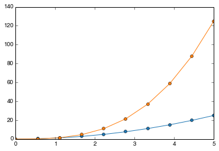
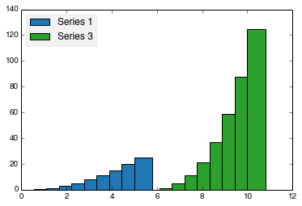

mplstyler
=========

An API for ensuring consistent line and marker styles across your plots. Assign colours, markers, line-styles to labels and re-use on subsequent plots. Styles can be matched to specific labels using exact or fuzzy matching to consecutively build up styles. Export styles to XML and re-import in subsequent sessions.

The following demo shows how to use StylesManager in auto mode to automatically set colors. More examples will be added shortly
demonstrating the use of manual-styles.

Future planned features include XML import/export of styles and integration with mpltools.

.. code:: python

    from mplstyler import StylesManager
    
    styles = StylesManager()
.. code:: python

    from pylab import *
.. code:: python

    x = linspace(0, 5, 10)
    y1 = x ** 2
    y2 = x ** 3
.. code:: python

    figure()
    
    s = styles.get_style_for_class('Series 1')
    plot(x, y1, **s.kwargs)
    
    s = styles.get_style_for_class('Series 2')
    plot(x, y2, **s.kwargs)
    
    show()

.. code:: python

    figure()

    from collections import OrderedDict

    l = OrderedDict()
    s = styles.get_style_for_class('Series 1')
    l['Series 1'] = bar(x, y1, **s.bar_kwargs)
    
    s = styles.get_style_for_class('Series 3')
    l['Series 3'] = bar(max(x)+x, y2, **s.bar_kwargs)
    
    leg = legend(l.values(), l.keys(),
       loc='best') 
    leg.get_frame().set_facecolor('k')                      
    leg.get_frame().set_alpha(0.05)     
    
    
    show()

Notice that Series 1 has again been displayed using the same colour, since the classname ('Series 1')
is unchanged.